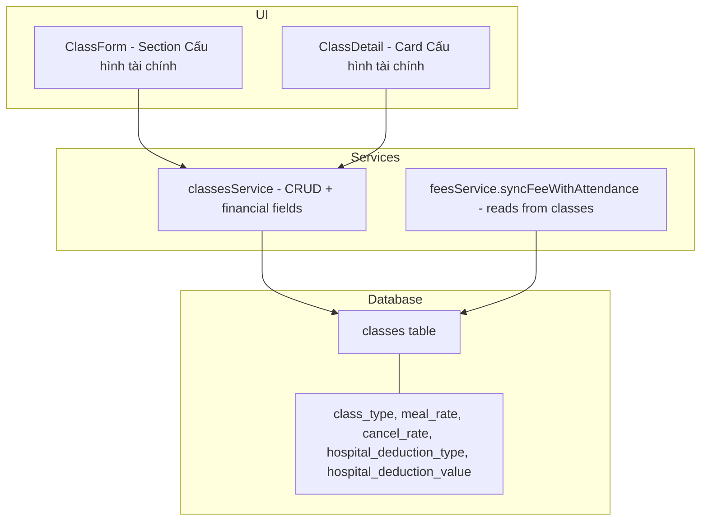
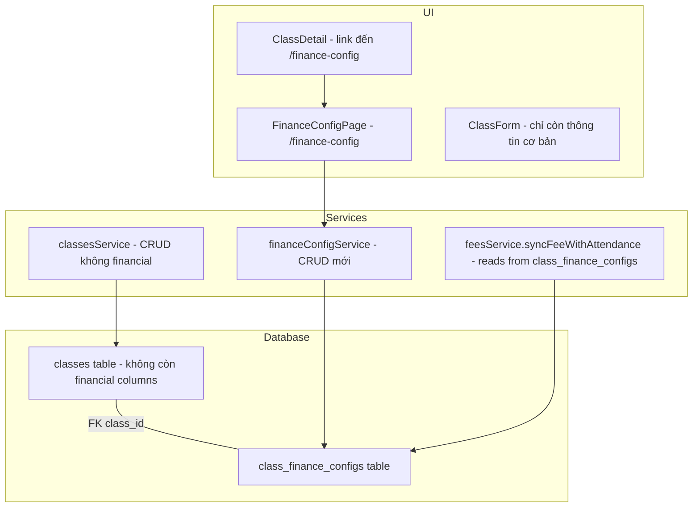

# Kế hoạch: Tách chức năng Cấu hình Tài chính (Khấu trừ) khỏi màn Classes

**Ngày tạo:** 2026-05-13
**Mức độ:** Tách toàn diện (UI + Database)
**Người dùng yêu cầu:** Admin
**Trạng thái:** Draft

---

## 1. Tổng quan

### 1.1. Hiện trạng

Hiện tại các trường cấu hình tài chính (`class_type`, `meal_rate`, `cancel_rate`, `hospital_deduction_type`, `hospital_deduction_value`) đang nằm trực tiếp trên bảng `classes` và được quản lý trong các trang:

| Trang | Vị trí | Mô tả |
|-------|--------|-------|
| [`ClassForm.tsx`](kindergarten-management/src/pages/ClassForm.tsx:264) | Lines 264-334 | Form "Cấu hình tài chính (Khấu trừ)" trong form tạo/sửa lớp |
| [`ClassDetail.tsx`](kindergarten-management/src/pages/ClassDetail.tsx:188) | Lines 188-227 | Card "Cấu hình tài chính (Khấu trừ)" trong tab Thông tin |

### 1.2. Mục tiêu

- Tạo bảng riêng `class_finance_configs` để lưu cấu hình tài chính
- Tạo trang quản lý riêng `/finance-config` dành cho Admin/Accountant
- Xóa phần cấu hình tài chính khỏi form tạo/sửa lớp (ClassForm)
- Xóa card cấu hình tài chính khỏi màn chi tiết lớp (ClassDetail), thay bằng link điều hướng
- Cập nhật `feesService.syncFeeWithAttendance()` để đọc từ bảng mới
- Di trú dữ liệu hiện có sang bảng mới an toàn

---

## 2. Sơ đồ Kiến trúc

### 2.1. Kiến trúc hiện tại



### 2.2. Kiến trúc mới



---

## 3. Kế hoạch triển khai chi tiết

### Bước 1: Tạo bảng `class_finance_configs` và migration

#### 1.1. Schema cho bảng mới

```sql
CREATE TABLE class_finance_configs (
    id              BIGSERIAL PRIMARY KEY,
    class_id        BIGINT NOT NULL UNIQUE REFERENCES classes(id) ON DELETE CASCADE,
    class_type      VARCHAR(20) NOT NULL DEFAULT 'Daycare' CHECK (class_type IN ('Daycare', 'Evening')),
    meal_rate       INTEGER NOT NULL DEFAULT 20000,
    cancel_rate     INTEGER NOT NULL DEFAULT 50000,
    hospital_deduction_type VARCHAR(10) NOT NULL DEFAULT 'Fixed' CHECK (hospital_deduction_type IN ('Fixed', 'Daily')),
    hospital_deduction_value INTEGER NOT NULL DEFAULT 0,
    del_yn          BOOLEAN NOT NULL DEFAULT FALSE,
    created_at      TIMESTAMPTZ NOT NULL DEFAULT NOW(),
    updated_at      TIMESTAMPTZ NOT NULL DEFAULT NOW()
);

CREATE INDEX idx_class_finance_configs_class_id ON class_finance_configs(class_id) WHERE del_yn = FALSE;
```

#### 1.2. Migration data từ `classes` sang `class_finance_configs`

```sql
INSERT INTO class_finance_configs (class_id, class_type, meal_rate, cancel_rate, hospital_deduction_type, hospital_deduction_value)
SELECT id, class_type, meal_rate, cancel_rate, hospital_deduction_type, hospital_deduction_value
FROM classes
WHERE del_yn = FALSE
ON CONFLICT (class_id) DO NOTHING;
```

#### 1.3. Xóa columns cũ khỏi `classes` (sau khi xác nhận migration OK)

```sql
ALTER TABLE classes 
  DROP COLUMN class_type,
  DROP COLUMN meal_rate,
  DROP COLUMN cancel_rate,
  DROP COLUMN hospital_deduction_type,
  DROP COLUMN hospital_deduction_value;
```

#### 1.4. RLS Policies

```sql
-- SELECT: Auth users can read configs for classes they have access to
CREATE POLICY class_finance_configs_select ON class_finance_configs 
  FOR SELECT USING (auth.uid() IS NOT NULL);

-- INSERT/UPDATE/DELETE: Only Admin/Accountant
CREATE POLICY class_finance_configs_insert ON class_finance_configs 
  FOR INSERT WITH CHECK (
    EXISTS (SELECT 1 FROM profiles WHERE id = auth.uid() AND role IN ('Admin', 'Accountant'))
  );

CREATE POLICY class_finance_configs_update ON class_finance_configs 
  FOR UPDATE USING (
    EXISTS (SELECT 1 FROM profiles WHERE id = auth.uid() AND role IN ('Admin', 'Accountant'))
  );

CREATE POLICY class_finance_configs_delete ON class_finance_configs 
  FOR DELETE USING (
    EXISTS (SELECT 1 FROM profiles WHERE id = auth.uid() AND role IN ('Admin', 'Accountant'))
  );
```

**File:** `kindergarten-management/supabase/migrations/20260513_create_class_finance_configs.sql`

---

### Bước 2: Cập nhật Type Definitions

#### 2.1. Thêm types mới vào [`domain.ts`](kindergarten-management/src/types/domain.ts)

Thêm vào sau `ClassRecord`:

```typescript
// ─── Class Finance Config ────────────────────────────────────────────────────

export interface ClassFinanceConfig {
  id: number;
  class_id: number;
  class_name?: string;  // joined field for display
  class_type: 'Daycare' | 'Evening';
  meal_rate: number;
  cancel_rate: number;
  hospital_deduction_type: 'Fixed' | 'Daily';
  hospital_deduction_value: number;
  created_at: string;
  updated_at: string;
}

export interface CreateFinanceConfigInput {
  class_id: number;
  class_type: 'Daycare' | 'Evening';
  meal_rate: number;
  cancel_rate: number;
  hospital_deduction_type: 'Fixed' | 'Daily';
  hospital_deduction_value: number;
}

export type UpdateFinanceConfigInput = Partial<CreateFinanceConfigInput>;

export interface FinanceConfigListQuery {
  page: number;
  pageSize: number;
  search?: string;
  sortBy?: 'class_name' | 'class_type' | 'created_at';
  sortDirection?: SortDirection;
}
```

#### 2.2. Sửa `ClassRecord` - xóa financial fields

```typescript
// XÓA các dòng: class_type, meal_rate, cancel_rate, hospital_deduction_type, hospital_deduction_value
// khỏi ClassRecord
```

#### 2.3. Sửa `CreateClassInput` - xóa financial fields

```typescript
// XÓA các dòng: class_type?, meal_rate?, cancel_rate?, hospital_deduction_type?, hospital_deduction_value?
// khỏi CreateClassInput
```

---

### Bước 3: Tạo Service `financeConfigService.ts`

**File mới:** `kindergarten-management/src/services/financeConfigService.ts`

Service này cung cấp:
- `listFinanceConfigs(query)` - List tất cả class finance configs (có pagination, search, sort)
- `getFinanceConfigByClassId(classId)` - Lấy config cho 1 lớp
- `createFinanceConfig(input)` - Tạo mới (khi tạo class mới)
- `updateFinanceConfig(classId, input)` - Cập nhật
- `deleteFinanceConfig(classId)` - Xóa (soft delete)

Service sẽ join với `classes` để lấy `class_name` cho hiển thị.

Guard: `ensureFinancialAccess(true)` cho mọi mutation.

---

### Bước 4: Cập nhật `classesService.ts`

#### 4.1. Sửa `ClassRow` type
Xóa các trường financial khỏi type:

```typescript
// XÓA: class_type, meal_rate, cancel_rate, hospital_deduction_type, hospital_deduction_value
```

#### 4.2. Sửa `mapClassRow()`
Xóa mapping cho các trường financial.

#### 4.3. Sửa `createClass()`
- Xóa financial fields khỏi payload
- Sau khi tạo class thành công, gọi `createFinanceConfig()` với default values

#### 4.4. Sửa `updateClass()`
- Xóa guard cho financial fields (lines 201-203)
- Xóa financial fields khỏi payload

#### 4.5. Sửa `deleteClass()`
- `class_finance_configs` sẽ tự cascade delete nhờ `ON DELETE CASCADE`

---

### Bước 5: Cập nhật `feesService.ts`

#### 5.1. Sửa `syncFeeWithAttendance()`

Hiện tại (lines 467-498) đọc `classConfig.class_type`, `classConfig.meal_rate`, `classConfig.cancel_rate`, `classConfig.hospital_deduction_type`, `classConfig.hospital_deduction_value` từ bảng `classes`.

Sửa thành: join với `class_finance_configs` hoặc query riêng:

```typescript
// Query mới:
const { data: financeConfig } = await supabase
  .from('class_finance_configs')
  .select('class_type, meal_rate, cancel_rate, hospital_deduction_type, hospital_deduction_value')
  .eq('class_id', classId)
  .eq('del_yn', false)
  .single();

const mealRate = financeConfig?.meal_rate || 20000;
const cancelRate = financeConfig?.cancel_rate || 50000;
const hospitalType = financeConfig?.hospital_deduction_type;
const hospitalVal = financeConfig?.hospital_deduction_value || 0;
```

---

### Bước 6: Tạo trang mới `FinanceConfigPage.tsx`

**File mới:** `kindergarten-management/src/pages/FinanceConfigPage.tsx`

#### UX Design:
- Trang danh sách hiển thị tất cả các lớp và cấu hình tài chính của chúng
- Table columns: Tên lớp, Loại lớp, Tiền cơm/ngày (hoặc Tiền nghỉ/buổi), Kiểu khấu trừ viện, Giá trị khấu trừ, Hành động
- Có search bar tìm theo tên lớp
- Có pagination
- Click nút "Sửa" mở modal edit (hoặc chuyển đến form)
- Hỗ trợ chỉnh sửa inline hoặc qua modal
- Chỉ Admin và Accountant có quyền truy cập

#### State Management:
- Sử dụng pattern giống `Classes.tsx`: `useState` + `useCallback` + `useEffect`
- Dùng `listFinanceConfigs()` từ `financeConfigService`

#### Access Control:
- Dùng `canManageFinance(role)` từ rbac.ts
- RoleGuard ở route level (App.tsx)

---

### Bước 7: Cập nhật ClassDetail.tsx

#### 7.1. Xóa card "Cấu hình tài chính (Khấu trừ)" (lines 188-227)

#### 7.2. Thêm link điều hướng

Thay thế bằng 1 nút hoặc link:

```tsx
{hasFinanceAccess && (
  <Button 
    variant="outline" 
    size="sm" 
    onClick={() => navigate(`/finance-config?classId=${classItem.id}`)}
  >
    <Calculator className="w-4 h-4" />
    Quản lý cấu hình tài chính
  </Button>
)}
```

---

### Bước 8: Cập nhật ClassForm.tsx

#### 8.1. Xóa section "Cấu hình tài chính (Khấu trừ)" (lines 264-334)

#### 8.2. Xóa financial fields khỏi `FormState`

```typescript
// XÓA: class_type, meal_rate, cancel_rate, hospital_deduction_type, hospital_deduction_value
```

#### 8.3. Xóa financial fields khỏi payload khi submit

#### 8.4. Khi tạo class mới thành công:
- Tự động tạo `class_finance_configs` với default values
- Hoặc redirect đến `/finance-config` để user tự cấu hình

**Khuyến nghị:** Tự động tạo config với default values khi tạo class. User có thể sửa sau tại `/finance-config`.

---

### Bước 9: Cập nhật Routing (App.tsx)

Thêm route mới:

```typescript
const FinanceConfigPage = lazy(() => import('@/pages/FinanceConfigPage'));

// Trong Routes:
<Route path="/finance-config" element={allow(['Admin', 'Accountant'], <FinanceConfigPage />)} />
```

---

### Bước 10: Cập nhật Sidebar Navigation

Thêm menu item vào `NAV_ITEMS` trong [`Sidebar.tsx`](kindergarten-management/src/components/layout/Sidebar.tsx):

```typescript
{ label: 'Cấu hình TC', path: '/finance-config', icon: Calculator, allow: ['Admin', 'Accountant'] },
```

Cần import thêm icon `Calculator` từ lucide-react (đã import sẵn ở ClassForm).

---

### Bước 11: Cập nhật RBAC

File [`rbac.ts`](kindergarten-management/src/lib/rbac.ts):

Không cần thay đổi gì vì `canManageFinance()` đã tồn tại và trả về `Admin | Accountant`.

Có thể thêm route vào `ROLE_ROUTE_ACCESS` để tham chiếu:

```typescript
'/finance-config': ['Admin', 'Accountant'],
```

---

### Bước 12: Cập nhật Tests

#### 12.1. Test files cần sửa:

| File | Thay đổi |
|------|----------|
| `src/services/__tests__/classesService.test.ts` | Xóa test cases liên quan đến financial fields trong createClass/updateClass |
| `src/services/__tests__/feesService.test.ts` | Mock `class_finance_configs` thay vì `classes` cho financial data |
| `src/services/__tests__/feesService_Phase5.test.ts` | Tương tự |
| `src/services/__tests__/attendance_fee_sync.test.ts` | Mock `class_finance_configs` |
| `src/services/__tests__/security.test.ts` | Cập nhật kiểm tra financial field guards |

#### 12.2. Test files mới cần tạo:

| File | Mô tả |
|------|-------|
| `src/services/__tests__/financeConfigService.test.ts` | Test CRUD cho finance config service |

---

## 4. Danh sách công việc (Todo List)

- [ ] B1: Tạo migration SQL: bảng `class_finance_configs`, migrate data, drop columns cũ, RLS
- [ ] B2: Cập nhật types (`domain.ts`): thêm `ClassFinanceConfig` types, xóa financial fields khỏi `ClassRecord`/`CreateClassInput`
- [ ] B3: Tạo `financeConfigService.ts` với CRUD operations
- [ ] B4: Cập nhật `classesService.ts`: xóa financial fields, tự động tạo finance config khi tạo class
- [ ] B5: Cập nhật `feesService.ts` `syncFeeWithAttendance()`: đọc từ `class_finance_configs`
- [ ] B6: Tạo `FinanceConfigPage.tsx` - trang quản lý cấu hình tài chính
- [ ] B7: Cập nhật `ClassDetail.tsx`: xóa card tài chính, thêm link điều hướng
- [ ] B8: Cập nhật `ClassForm.tsx`: xóa section tài chính, tự động tạo config khi tạo class
- [ ] B9: Cập nhật `App.tsx`: thêm route `/finance-config`
- [ ] B10: Cập nhật `Sidebar.tsx`: thêm menu "Cấu hình TC"
- [ ] B11: Cập nhật `rbac.ts`: thêm route `/finance-config`
- [ ] B12: Cập nhật tests hiện có + tạo test mới cho `financeConfigService`
- [ ] B13: Cập nhật E2E tests (nếu có liên quan)
- [ ] B14: Chạy toàn bộ test suite xác nhận không regression

---

## 5. Các điểm cần lưu ý

### 5.1. Seed data
File [`seed.ts`](kindergarten-management/src/scripts/seed.ts) cần được cập nhật để seed cả `class_finance_configs`.

### 5.2. SYSTEM_COMPACT.json
File [`SYSTEM_COMPACT.json`](kindergarten-management/SYSTEM_COMPACT.json) cần cập nhật:
- Thêm `financeConfigService.ts` vào `service_files`
- Cập nhật `route_access_matrix` với `/finance-config`
- Cập nhật `page_wiring_inventory`

### 5.3. Vấn đề rollback
- Migration nên được thiết kế để có thể rollback (đổi tên columns thay vì drop ngay)
- Nên chạy migration trên staging/development trước

### 5.4. Cascade Delete
- `ON DELETE CASCADE` trên `class_finance_configs.class_id` đảm bảo khi xóa class, config cũng bị xóa
- Khi soft-delete class (set `del_yn = true`), cũng cần soft-delete config tương ứng

### 5.5. Sync giữa class và finance config
- Khi tạo class mới: tự động tạo finance config với default values
- Khi xóa class: cascade delete finance config
- Đảm bảo mỗi class luôn có đúng 1 finance config (UNIQUE constraint)

---

## 6. Kết luận

Kế hoạch này tách toàn bộ chức năng "Cấu hình tài chính (Khấu trừ)" ra khỏi module classes ở cả 3 tầng:

1. **Database**: Bảng mới `class_finance_configs` với UNIQUE FK đến `classes`
2. **Service**: Service mới `financeConfigService.ts`, cập nhật `classesService` và `feesService`
3. **UI**: Trang mới `/finance-config`, xóa financial section khỏi ClassForm và ClassDetail

Việc tách này giúp:
- Phân tách rõ ràng trách nhiệm giữa quản lý lớp học và quản lý tài chính
- Admin/Accountant có thể quản lý cấu hình tài chính tập trung tại 1 nơi
- Giảm phức tạp cho ClassForm (chỉ tập trung vào thông tin lớp học)
- An toàn hơn về mặt bảo mật (financial config được bảo vệ riêng)
