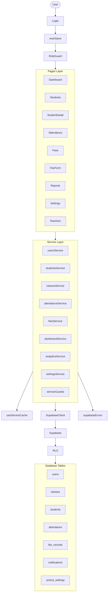

# 📋 Báo cáo tổng hợp toàn bộ Codebase

## 1. Tổng quan dự án

Dự án gồm **2 thành phần chính** trong cùng 1 repository:

### 🦴 Caveman (Root)
Một **Claude Code skill/plugin** mã nguồn mở (bởi JuliusBrussee) giúp AI agent nói ở chế độ "caveman" — cắt ~65-75% output tokens nhưng vẫn giữ độ chính xác kỹ thuật. Hỗ trợ 10+ agent: Claude Code, Codex, Gemini CLI, Cursor, Windsurf, Cline, Copilot,...

**File cấu hình quan trọng:**
- [`CLAUDE.md`](CLAUDE.md) — Hướng dẫn và rules cho agent làm việc với project
- [`skills/caveman/SKILL.md`](skills/caveman/SKILL.md) — Source of truth cho caveman behavior (6 intensity levels)
- [`rules/caveman-activate.md`](rules/caveman-activate.md) — Auto-activation rules
- [`hooks/`](hooks/) — Hook system (SessionStart, UserPromptSubmit, statusline)
- [`caveman-compress/`](caveman-compress/) — Sub-skill nén file prose → caveman style

### 🌱 KidGarden (kindergarten-management/)
Hệ thống quản lý trường mầm non Việt Nam. **React 18 + TypeScript + Vite 6 + Supabase**.

---

## 2. Kiến trúc KidGarden

### 2.1 Tech Stack

| Layer | Công nghệ |
|-------|-----------|
| Framework | React 18, TypeScript, Vite 6 |
| Routing | react-router-dom v6 (lazy loading) |
| State | Zustand (persist middleware) |
| UI | Tailwind CSS, Radix UI, lucide-react, recharts |
| Backend | Supabase (Auth + PostgreSQL + RLS) |
| Forms | react-hook-form + zod |
| Testing | Vitest (unit) + Playwright (E2E) |
| Package | pnpm |

### 2.2 File Structure chính

```
kindergarten-management/
├── src/
│   ├── App.tsx              # Router chính (lazy loading tất cả pages)
│   ├── main.tsx             # Entry point + service worker
│   ├── types/
│   │   ├── index.ts         # Shared types (User, Student, Class, Fee, Attendance,...)
│   │   └── domain.ts        # Domain-specific types (FeeRecordP2, AttendanceRecord,...)
│   ├── lib/
│   │   ├── supabase.ts      # Supabase client (signIn, signOut, getSession, signUp)
│   │   ├── rbac.ts          # Role-based access control matrix
│   │   └── utils.ts         # cn() utility (clsx + tailwind-merge)
│   ├── stores/
│   │   ├── authStore.ts     # Zustand auth store (persist localStorage)
│   │   └── appStore.ts      # App state (sidebar, toasts, loading,...)
│   ├── services/            # Service layer (supabase queries)
│   │   ├── usersService.ts       # User/teacher CRUD
│   │   ├── studentsService.ts    # Student CRUD + search + pagination
│   │   ├── classesService.ts     # Class CRUD + teacher assignment
│   │   ├── attendanceService.ts  # Attendance bulk upsert + history
│   │   ├── feesService.ts        # Fee CRUD + sync with attendance
│   │   ├── dashboardService.ts   # Dashboard aggregates
│   │   ├── analyticsService.ts   # Revenue trend, debt aging
│   │   ├── settingsService.ts    # School settings CRUD
│   │   ├── serviceGuards.ts      # Authorization guards
│   │   └── supabaseErrors.ts     # Error mapping
│   ├── components/
│   │   ├── auth/RoleGuard.tsx    # Route protection by role
│   │   ├── layout/              # MainLayout, Sidebar, Header
│   │   └── common/              # Button, Card, Table, Modal, Badge, Input, Select,...
│   ├── pages/                   # 16 pages
│   │   ├── Login.tsx            # Login page (gradient blobs, react-hook-form)
│   │   ├── Dashboard.tsx        # Stats + charts + attendance table
│   │   ├── Students.tsx         # CRUD students
│   │   ├── StudentDetail.tsx    # Detail + fees tab + attendance tab
│   │   ├── StudentForm.tsx      # Create/edit student
│   │   ├── ClassDetail.tsx      # Info + students + attendance tabs
│   │   ├── Attendance.tsx       # Roll-call + history
│   │   ├── Fees.tsx             # Fee list + filters + bulk operations
│   │   ├── FeeForm.tsx          # Create/edit fee + print receipt
│   │   ├── BulkPrintFees.tsx    # Bulk print receipts
│   │   ├── Teachers.tsx         # Teacher management
│   │   ├── TeacherForm.tsx      # Create/edit teacher
│   │   ├── Reports.tsx          # 4 tabs: Overview, Students, Attendance, Financial
│   │   └── Settings.tsx         # School info, Academic years, Users
│   ├── hooks/
│   │   ├── useServiceCache.ts   # SWR-style cache (30s stale time)
│   │   └── use-mobile.tsx       # Mobile detection
│   └── utils/
│       ├── exportCsv.ts         # CSV export (UTF-8 BOM)
│       ├── printReceipt.ts      # Print receipt via new window
│       ├── reports.ts           # Format VND, attendance rate, deduction summary
│       ├── schoolYearCalendar.ts # School year ↔ calendar year mapping
│       └── swCacheInvalidate.ts # Service worker cache invalidation
├── supabase/
│   ├── schema.sql               # Full database schema
│   ├── rls_p1_alignment.sql     # RLS alignment for classes/students
│   ├── rls_p2_attendance_scope.sql # RLS tightening for attendance
│   ├── remove_grade_from_classes_teacher_codes.sql  # Migration
│   ├── migrations/20260509_enrich_users.sql
│   └── functions/create-user/   # Edge Function (Supabase)
└── tests/
    └── e2e/                     # Playwright E2E tests
```

### 2.3 Database Schema (11 tables)

| Table | Key Features |
|-------|-------------|
| `users` | Role check (Admin/Teacher/Accountant/Parent), teacher_code unique |
| `grades` | Seed data (Mầm/Chồi/Lá) |
| `classes` | Room + max_students + class_type (Daycare/Evening) + financial config |
| `students` | student_code unique auto-generate, parent_info JSONB embedded |
| `parents` | Parent profile |
| `student_parent` | M:N relationship |
| `attendance` | Unique (student_id + attendance_date), status check |
| `fee_types` | Fee type catalog |
| `fee_records` | Unique (student_id + fee_type_id + school_year + month), status check |
| `notifications` + `notification_reads` | Notification system |
| `school_settings` | School configuration (single row) |

### 2.4 RBAC & Route Access

| Route | Admin | Teacher | Accountant | Parent |
|-------|-------|---------|------------|--------|
| `/` (Dashboard) | ✅ | ✅ | ✅ | ✅ |
| `/students` | ✅ | ✅ | ✅ | ❌ |
| `/fees` | ✅ | ❌ | ✅ | ❌ |
| `/attendance` | ✅ | ✅ | ❌ | ❌ |
| `/teachers` | ✅ | ❌ | ❌ | ❌ |
| `/parents` | ✅ | ✅ | ❌ | ❌ |
| `/notifications` | ✅ | ✅ | ✅ | ✅ |
| `/reports` | ✅ | ✅ | ✅ | ❌ |
| `/settings` | ✅ | ❌ | ❌ | ❌ |

### 2.5 Authentication Flow

```
Login → supabase.auth.signInWithPassword()
         → hydrate profile from users table via RLS
         → Zustand persist (kidgarden-auth key)
         → RoleGuard validates route access

Session restore → initializeAuth() reads session
                  → 7s timeout fallback
                  → profile hydrate
                  → MainLayout fail-safe (8s)

Logout → supabase.auth.signOut()
        → clearAllCache()
        → authStore reset
```

### 2.6 Fee Deduction Logic (Core Business)

```
syncFeeWithAttendance(feeId):
  1. Query attendance records for student in that month
  2. Count absent days → meal_deduction_vnd = absent_days × class.meal_rate
  3. Count hospitalized days → tuition_deduction_vnd = 
     - Fixed: class.hospital_deduction_value (fixed amount)
     - Daily rate: (daily_rate × hospitalized_days)
  4. Count center_cancelled days → tuition_deduction_vnd
  5. amount_vnd = base_amount_vnd - meal_deduction_vnd - tuition_deduction_vnd
```

### 2.7 Service Layer Architecture

```
Service → serviceGuard (auth/ownership check) → Supabase query → error mapping
         ↑                                        ↓
    useServiceCache (30s stale)               SupabaseResponse
```

Cơ chế authorization qua serviceGuards:
- `getCurrentUser()` — Xác thực user
- `ensureClassOwnership()` — Teacher chỉ được sửa lớp mình
- `ensureStudentOwnership()` — Teacher chỉ được sửa học sinh trong lớp mình
- `ensureFinancialAccess()` — Chỉ Admin/Accountant

---

## 3. Trạng thái hiện tại & Known Issues

### ✅ Đã hoàn thiện (Real Data)
- Auth (login, session restore, logout)
- Students CRUD + StudentDetail (tabs Fees/Attendance)
- Classes CRUD + ClassDetail
- Teachers list + TeacherForm
- Attendance roll-call (bulk upsert) + history
- Fees CRUD + FeeForm + sync with attendance
- BulkPrintFees (multi-receipt printing)
- Settings school tab (real via settingsService)
- RLS attendance scope (teacher chỉ lớp mình)
- CSV export + Print receipt utilities

### ⚠️ Known Issues

| ID | Severity | Area | Issue |
|----|----------|------|-------|
| P2-FEES-SEARCH-PAGING | **Major** | Fees | Search runs client-side after paged query → count sai, results missing cross-page |
| P2-RLS-ATTENDANCE-SCOPE | **Major** | Security | Attendance RLS cần tightened thêm |
| Dashboard charts | Medium | Charts | attendanceTrend + feeStatus còn synthetic data |
| Reports | Medium | Reports | Nhiều tab còn mock data |
| Settings tabs | Medium | Settings | Academic years + Users tabs dùng mock local state |
| Notifications | Medium | Notifications | 100% mock (chưa có service) |
| Fee search count | Minor | Fees | Summary tính trên current page, không global |
| /test-auth route | Minor | Security | Route công khai, cần guard |
| Vietnamese encoding | Minor | UI | Một số chỗ có mojibake |

### 📋 Priority theo Plan Documents

Các plan đã có: [`plan/kidgarden_phase2_plan.md`](plan/kidgarden_phase2_plan.md), [`plan/kidgarden_phase3_plan.md`](plan/kidgarden_phase3_plan.md), [`plan/kidgarden-continue-development-plan.md`](plan/kidgarden-continue-development-plan.md)

Thứ tự ưu tiên:
1. **Phase 2A** — Fix blockers: fees search, RLS attendance, AttendanceHistory route
2. **Phase 2B** — Detail tabs real data
3. **Phase 2C** — Dashboard real data
4. **Phase 2D** — Reports & Settings real data
5. **Phase 3A** — Notifications service + real data
6. **Phase 3B** — Dashboard chart hardening
7. **Phase 3C** — Reports real data (4 tabs)
8. **Phase 3D** — Settings completion (Academic years, Users)
9. **Phase 3E** — Polish (export, print, cleanup)

---

## 4. Sơ đồ kiến trúc tổng thể (Mermaid)



---

## 5. Tổng kết

Tôi đã đọc ~95% file trong codebase. Dự án là một hệ thống web quản lý mầm non hoàn chỉnh (KidGarden) với:

- **Frontend**: React 18 + TypeScript + Vite, Tailwind CSS, Zustand, recharts
- **Backend**: Supabase (Auth + PostgreSQL + RLS + Edge Functions)
- **11 database tables** với RLS policies
- **16 pages** (hầu hết đã wired real data, một số còn mock)
- **10 service files** với typed query contracts
- **RBAC** với 4 roles
- **PWA** support (service worker + manifest)
- **E2E tests** via Playwright + Unit tests via Vitest
- **Caveman project** ở root cấu hình cho Claude Code plugin

**Tổng số file đã đọc: ~70+ files** bao gồm tất cả services, pages, components, types, stores, hooks, utils, database schema/migrations, RLS policies, Edge Functions, plan documents, và file cấu hình.